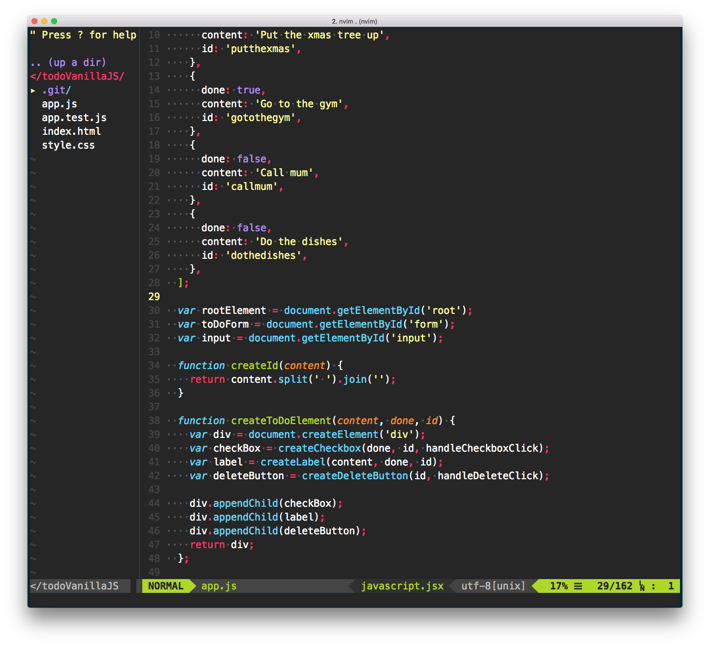
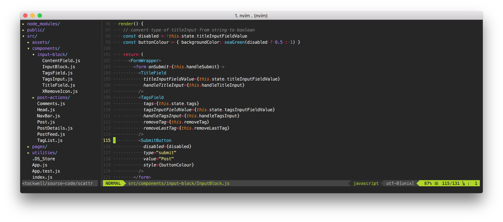
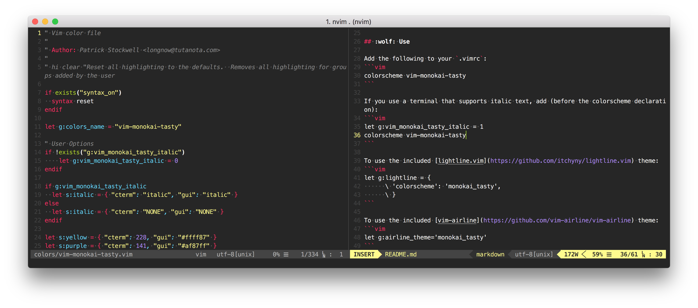

# vim-monokai-tasty

Monokai forever! :tada: Inspired by Sublime Text's interpretation of monokai, this colour is both gui- and cterm-supported.
It works for all languages, and is particularly good for Javascript development :heart:



## :electric_plug: Installation

I recommend using [Plug](https://github.com/junegunn/vim-plug).

Add the following to your `.vimrc` and run `PlugInstall`

```vim
Plug 'patstockwell/vim-monokai-tasty'
```

Works best with these if you write javascript or React
```vim
Plug 'pangloss/vim-javascript'
Plug 'MaxMEllon/vim-jsx-pretty'
Plug 'styled-components/vim-styled-components'
Plug 'elzr/vim-json'
```

## :wolf: Use

Add the following to your `.vimrc` (after the Plug declaration):
```vim
colorscheme vim-monokai-tasty
```

If you use a terminal that supports italic text, add (before the colorscheme declaration):
```vim
let g:vim_monokai_tasty_italic = 1
colorscheme vim-monokai-tasty
```

To use the included [lightline.vim](https://github.com/itchyny/lightline.vim) theme:
```vim
let g:lightline = {
      \ 'colorscheme': 'monokai_tasty',
      \ }
```

To use the included [vim-airline](https://github.com/vim-airline/vim-airline) theme:
```vim
let g:airline_theme='monokai_tasty'
```

## :crystal_ball: Extras

- If you use [iterm2](https://iterm2.com/) (you should), there is an included _monokai.itermcolors_ file.
- If you use GnuCoreutils there is a _dircolors_ file (compliments the iterm colours)

## :tv: Screen shots





